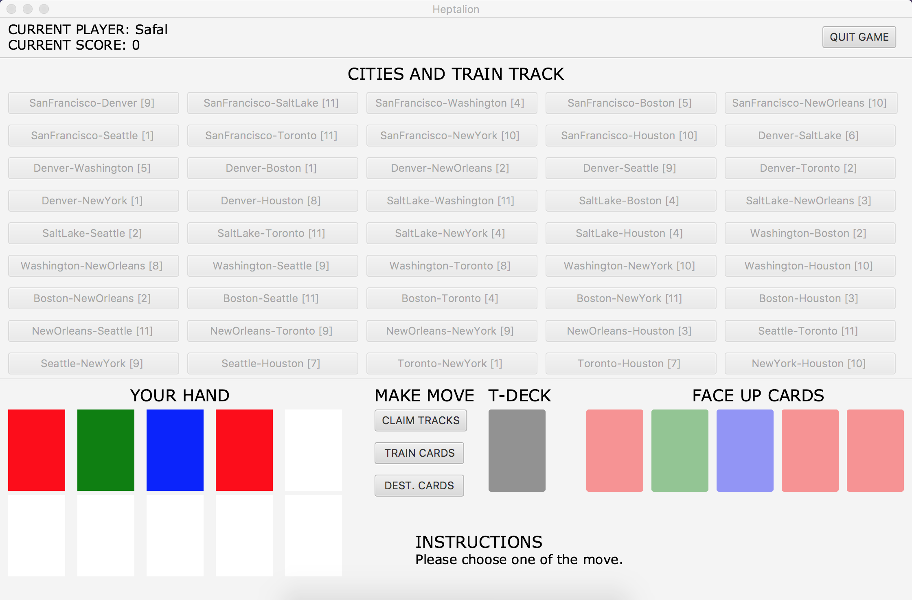
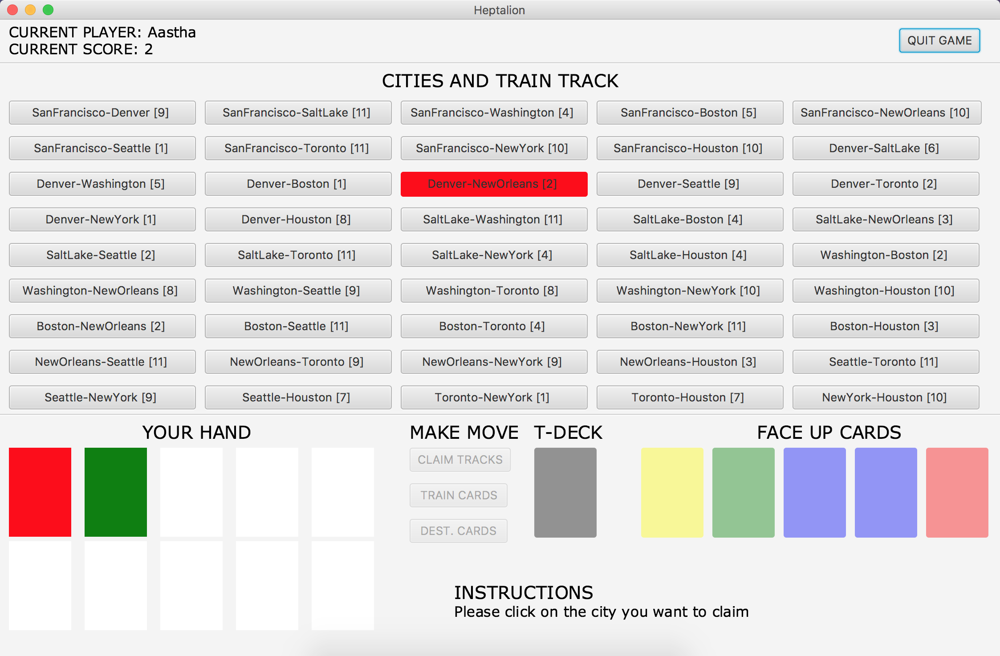
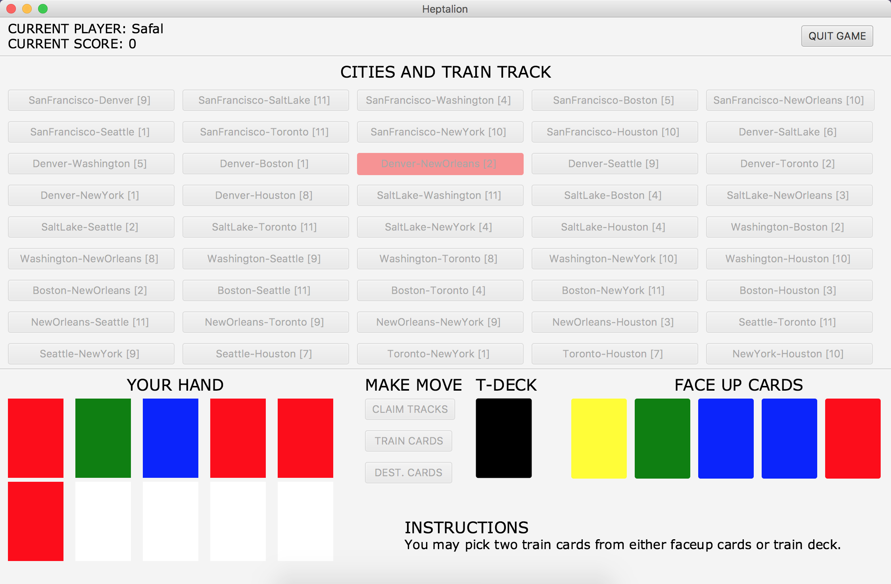
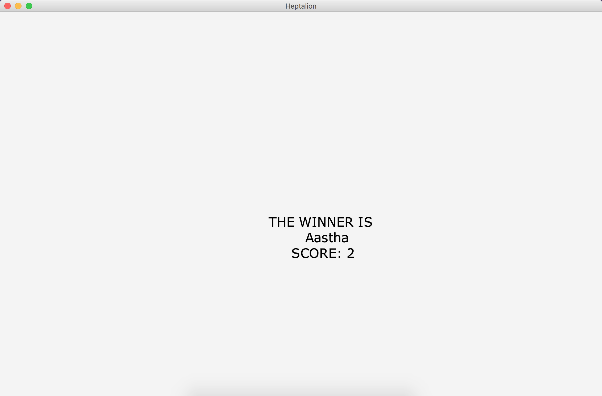

# TicketToRide

# HOW TO RUN?
- Run the main.java file under application folder.  
- The main function inside main.java should launch the javafx application.
- Please make sure dependencies are installed.

# HOW TO PLAY?
Once you run the program following view is displayed.  

- Your options are listed below
- You may pick any of three move [DEST. FETCH] not implemented as of now. 
- Or just quit game
## An example of claiming the city
Once you claim a city, all buttons will be disabled except the tracks.

- Your options are listed below
- Claim one of the tracks and see if the claim is possible.
- If you have enough cards on hand to claim the city, the track will turn red marking it claimed.
- If not you are prompted to choose another move or track.
- You may quit the game.

## An example of fetching train cards
Once you click fetch train cards, all buttons will be disabled except the train deck[BLACK] and five faceup cards.

- You can make two choice, for a choice click on either deck or faceup cards depending on where you want the card from.
- After two choices, your turn will be over and next player is asked to make a move
- You may quit the game.
## Ending the game and checking winner

- Click on quit, upper right corner.
- Winner or any other result will be displayed.
